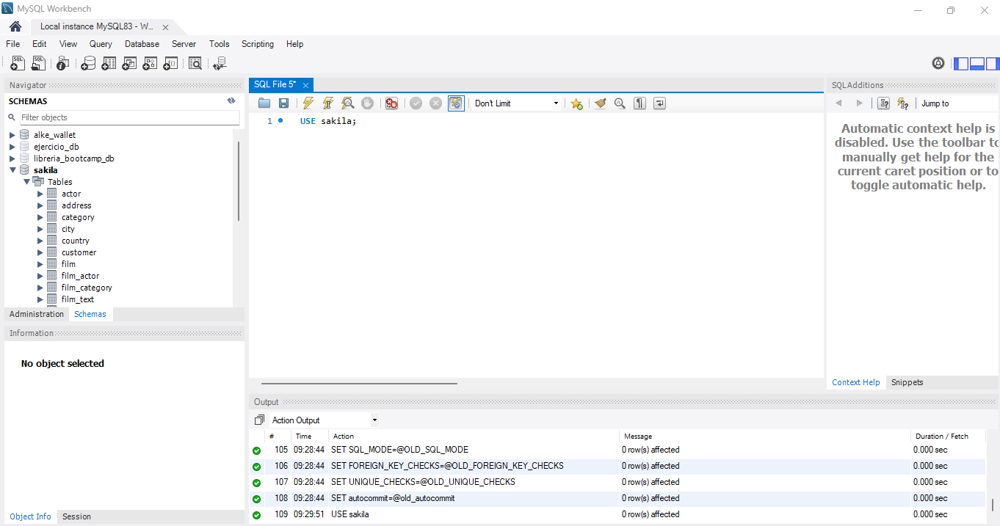
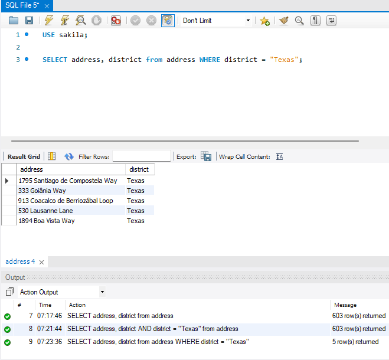
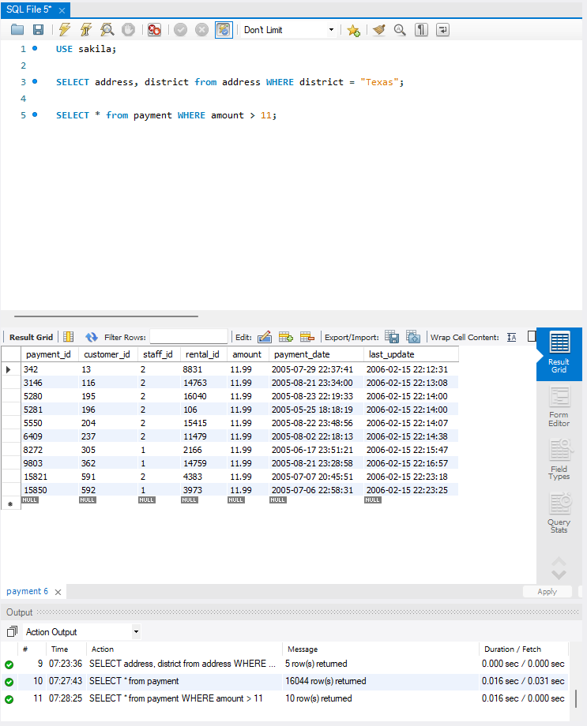
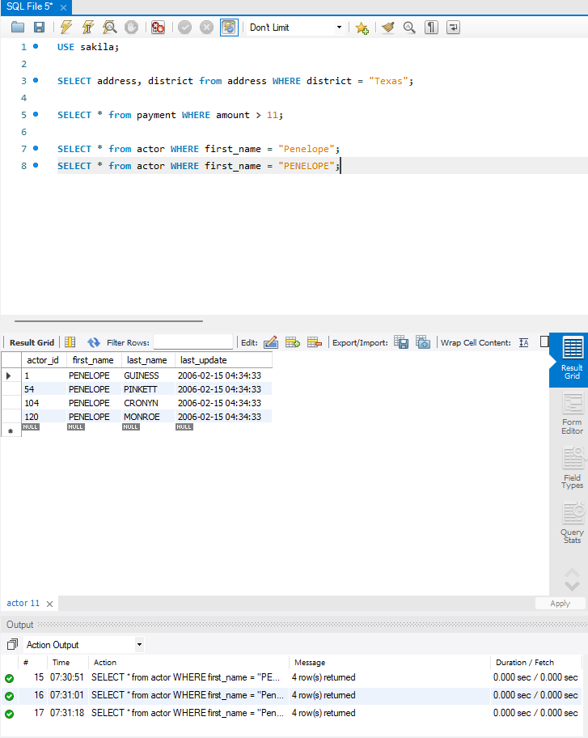
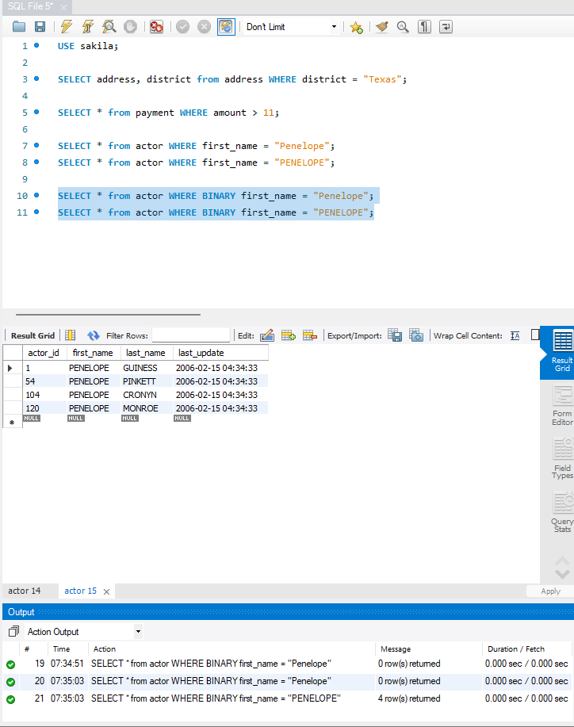
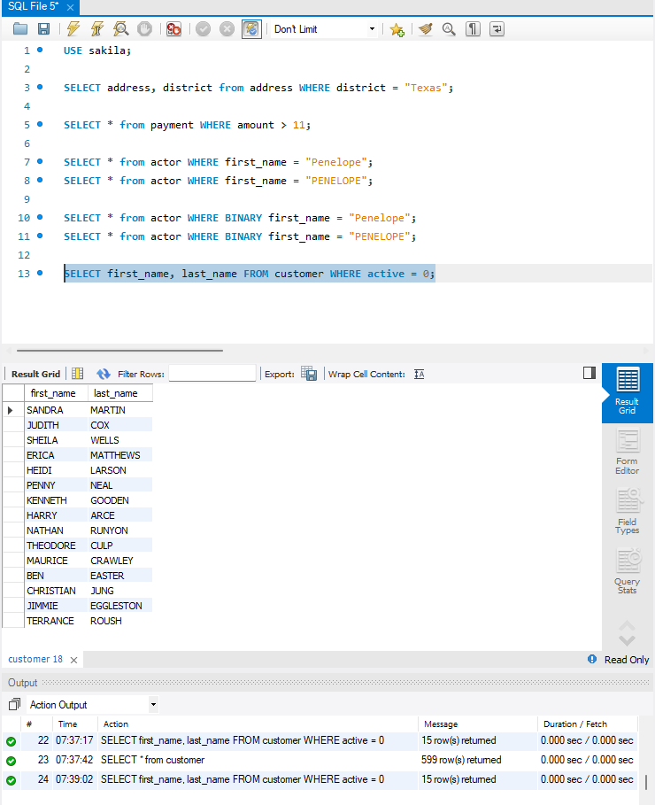
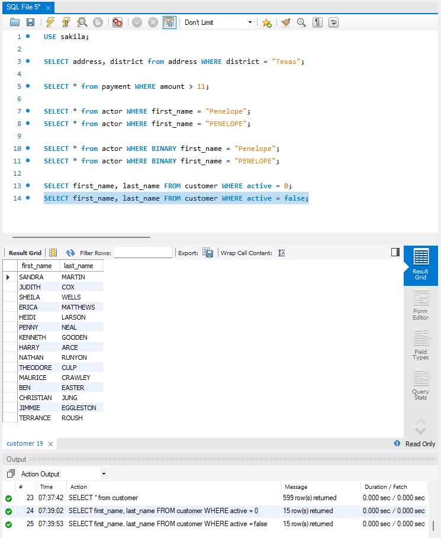
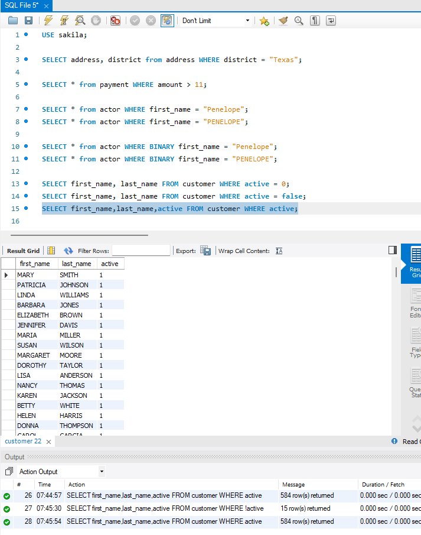
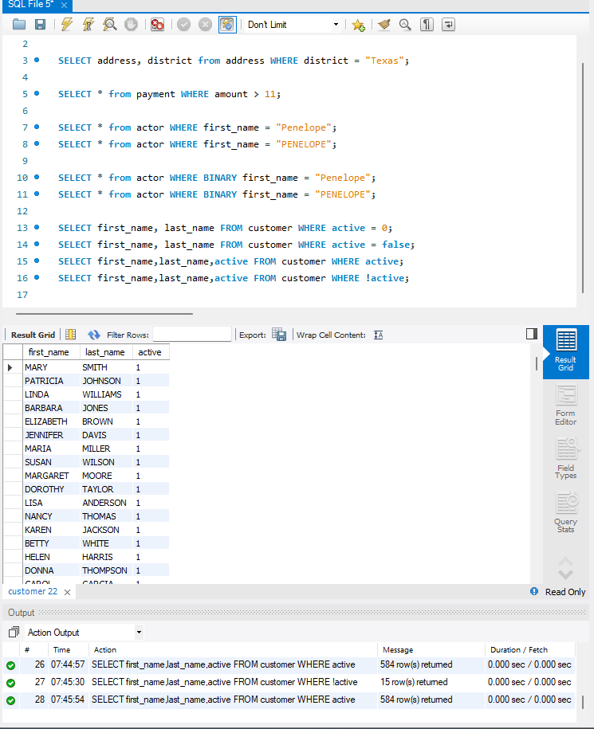
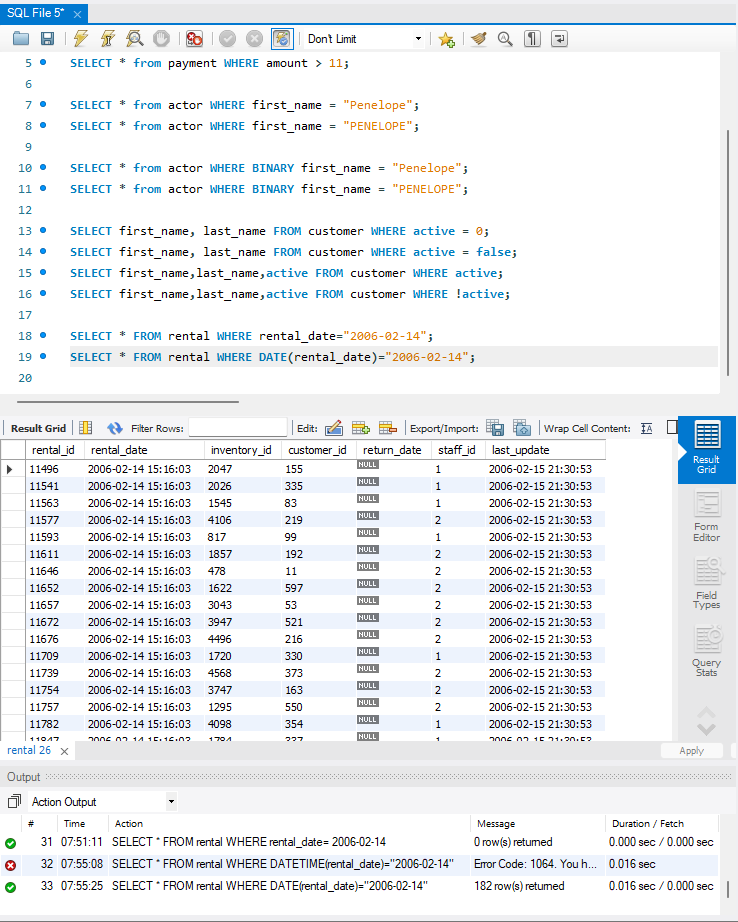

01./ Entra en la base de datos sakila”. Utiliza capturas de pantalla.

02./ Seleccionar los campos “address” y “district” de la tabla “address” donde
distrito sea Texas.

03./  Seleccionar todas las columnas de la table “payment” cuyo campo “amount”
sea mayor que 11.

04./  Visualizar todos los actores de la tabla “actor” cuyo first_name sea “Penelope”.
Prueba con mayúscula y minúsculas para ver si devuelve el mismo resultado.

05./  Hacer lo mismo, pero con la cláusula BINARY para comprobar la diferencia.

06./  Visualizar las columnas first_name y last_name de la tabla “customer” de
aquellos clientes que esté inactivos (campo “active” igual a 0) .

07./  Prueba cambiando la igualdad del CERO por un False. ¿funciona? Si es así
¿Cuál es el motivo?

--- El motivo es que en sql 0 es falso y cualquier otro sera verdadero ya que esta manejo los valores booleanos internamente  ---

08./  ¿Qué resultados daría el comando siguiente? ¿Los clientes activos o los
inactivos :
• select first_name,last_name,active from customer where active;

--  El resultado nos arrojo los activos  --

09./  ¿Y el siguiente?¿Activos o inactivos?
• select first_name,last_name,active from customer where !active;

-- El resultado nos arrojo los activos porque el simbolo ! significa lo contrario   --

10./  Si ejecutamos esta query contra la tabla “rental”:
select * from rental where rental_date="2006-02-14";
Verás que no aparece ninguna fila, a pesar de que si existen registros en esa fecha.
¿A qué es debido? ¿Cómo podríamos visualizar alguno de los registros?

-- Era porque rental_date es de tipo DATETIME que tambien incluye la hora, entonces si lo hacemos solo DATE ahi podemos ver la fecha relacionada excluyendo la hora   --

❖ PISTA. Si hacemos un desc de la tabla Rental comprobamos que la columna
rental_date es de tipo DATETIME, no es de tipo DATE