❖ Accedemos con mysql, mysql workbench o cualquier otra de las herramientas
con la que estés trabajando.
❖ Ejecuta el archivo “academia.sql”.

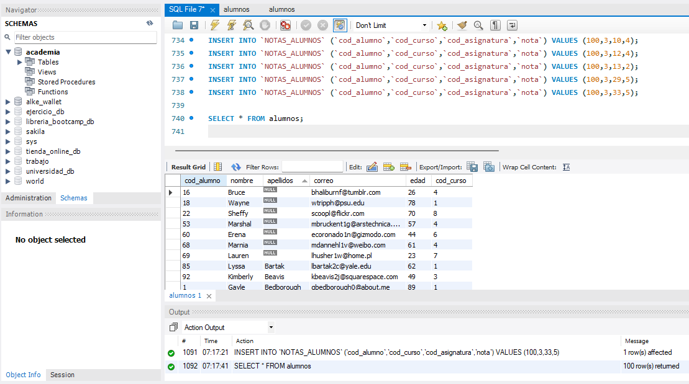

❖ Seleccionar el nombre del alumno número 10 y el curso que está haciendo

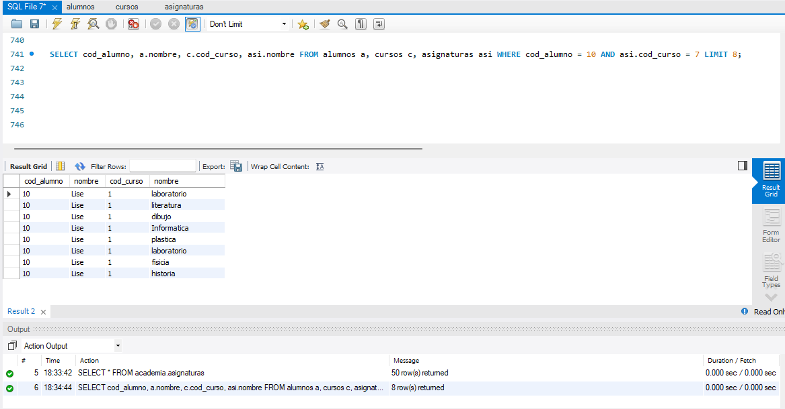

❖ Visualizar las asignaturas del curso 1.

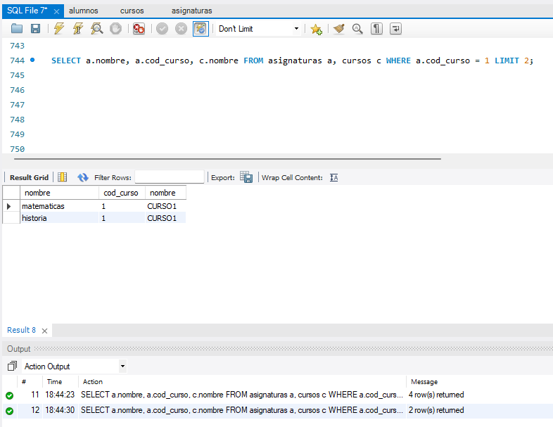

❖ Visualizar el número de asignaturas de cada curso.

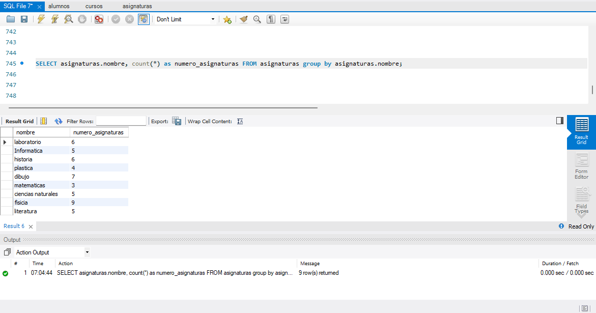

❖ Visualizar las asignaturas del profesor con el código 2.

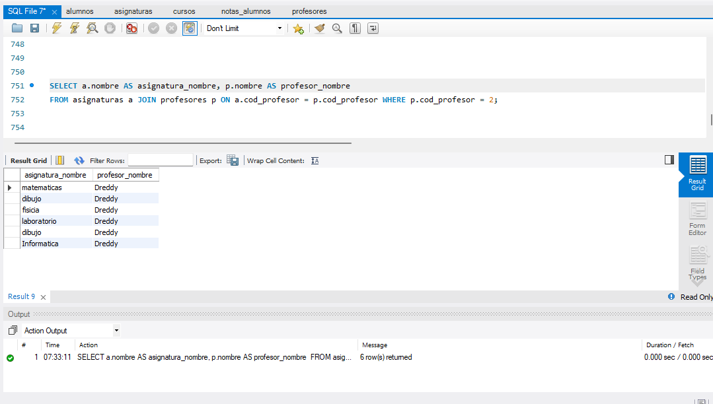

❖ Visualizar las notas del alumno 10

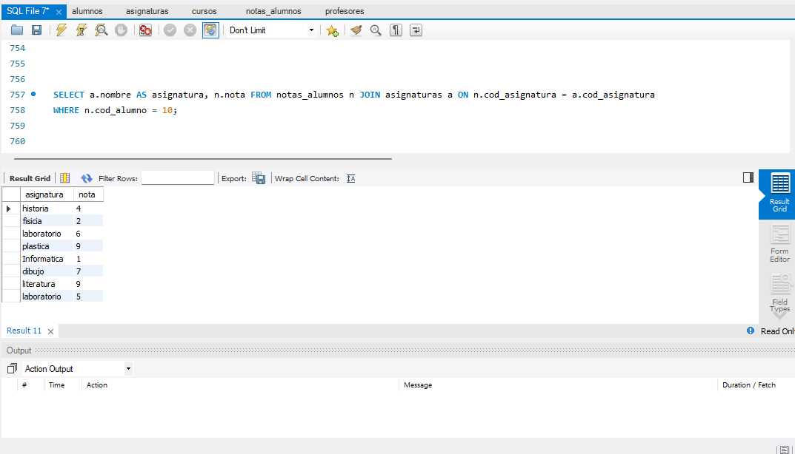

❖ Mostrar el curso y el promedio de notas de los alumnos

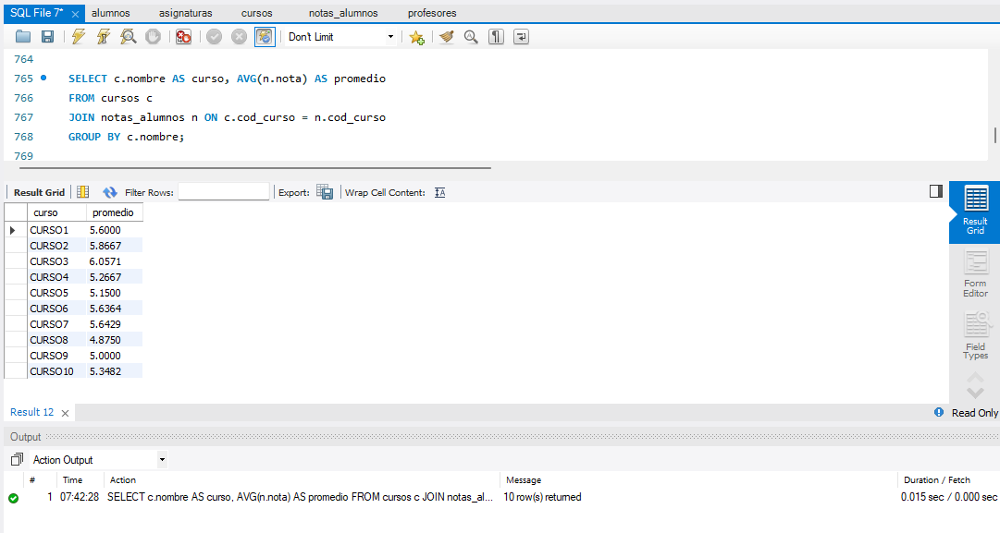

❖ Sacar el promedio, pero en este caso por asignatura.

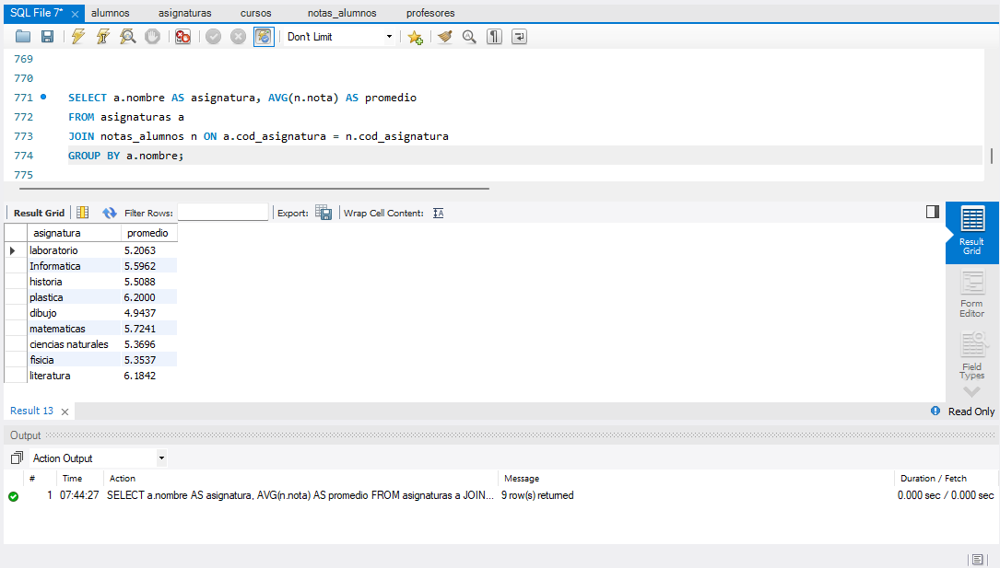

                                Probando LEFT Y RIGHT JOIN

❖ Inserta un par de filas en la tabla CURSOS. Esto permite tener dos cursos que
no tienen alumnos

insert into cursos values(11,'curso11',100);
insert into cursos values(12,'curso12',200);

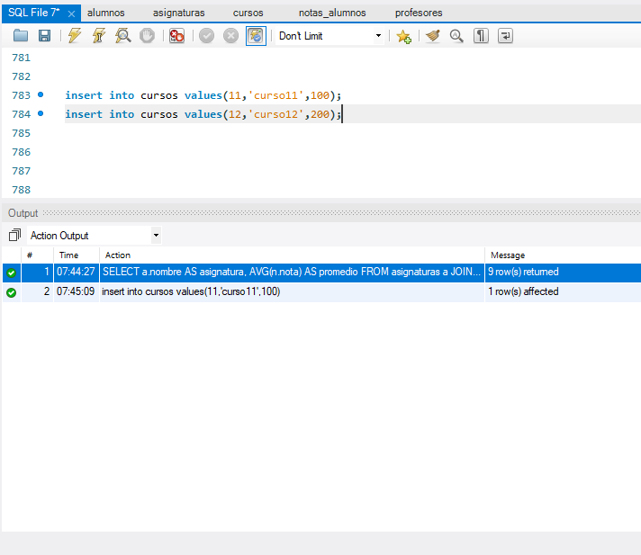

❖ Averiguar ahora el número de alumnos por curso. Debes usar la cláusula
USING para hacer la join ( Investiga sobre la clausaula USING y aplícala).

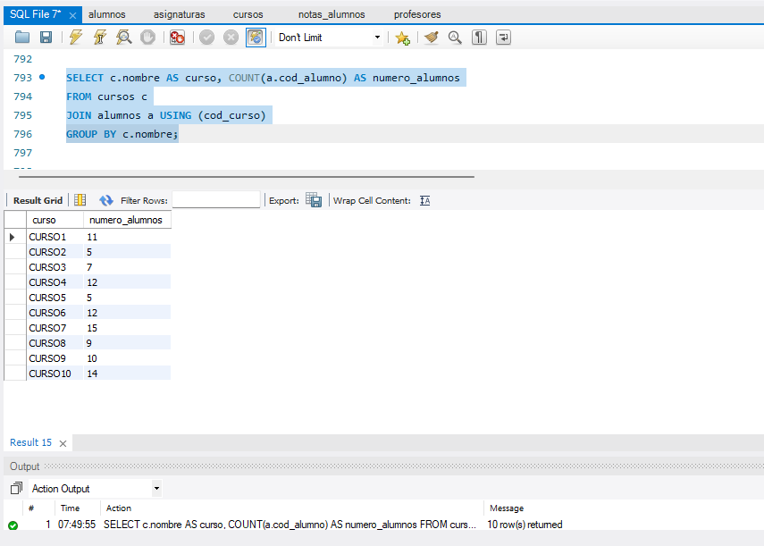

❖ Comprueba si aparecen los nuevos cursos. Hazlo con Left Join y deben
aparecer 0 alumnos.

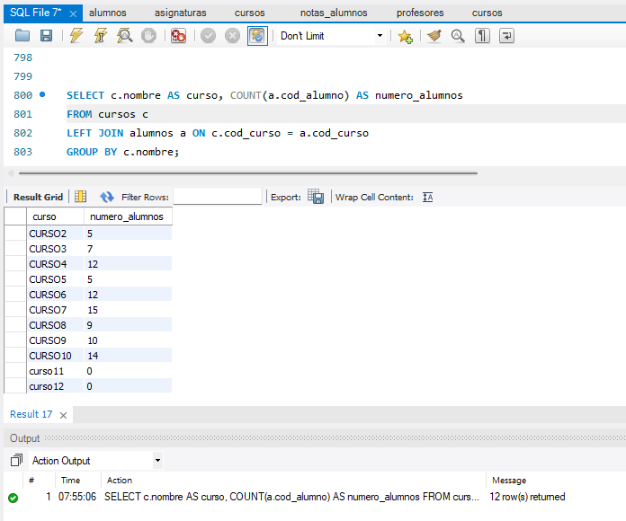

❖ Obtén cada asignatura con sus profesores. Hay algunos profesores que no
aparecen ya que no tienen asignaturas todavía. Los debes incluir con un
RIGHT JOIN 

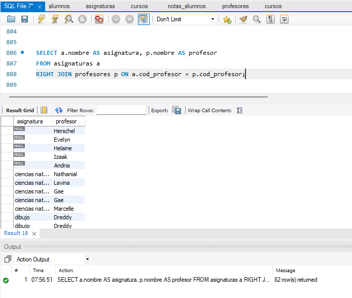

