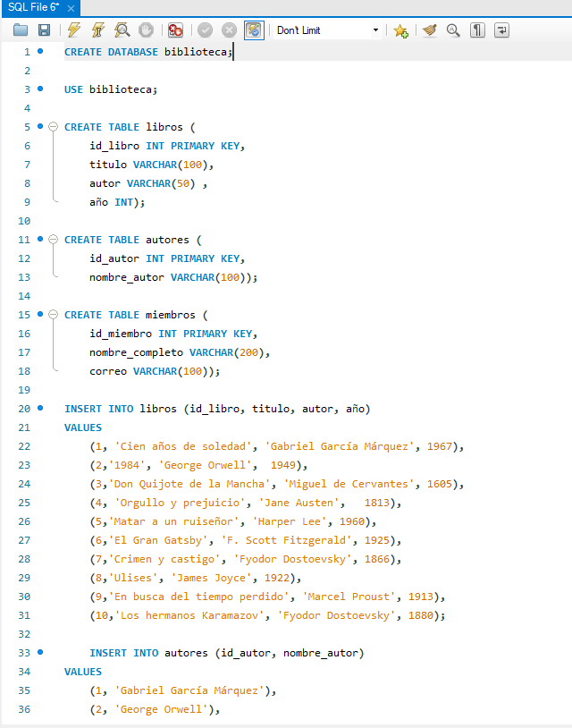

❖ Se crea la base de datos de la biblioteca

❖ Se llenan las tablas con datos y actualizo la tabla libros para agregar 
la columna id_miembro e id_autor para darle una clave foranea y hacer la relacion libros,autores y miembros y 
por ultimo hago UPDATE a libros para agregar los datos que el miembro con id 3, tomo prestado el libro con id 2 del mismo autor de id 2

❖ Tabla autores

❖ Tabla libro actualizada

❖ Tabla miembros

❖ Diagrama de entidades relacion

❖ Codigo de la base de datos

CREATE DATABASE biblioteca;

USE biblioteca;

CREATE TABLE libros (
id_libro INT PRIMARY KEY,
titulo VARCHAR(100),
autor VARCHAR(50) ,
año INT);

CREATE TABLE autores (
id_autor INT PRIMARY KEY,
nombre_autor VARCHAR(100));

CREATE TABLE miembros (
id_miembro INT PRIMARY KEY,
nombre_completo VARCHAR(200),
correo VARCHAR(100));

INSERT INTO libros (id_libro, titulo, autor, año)
VALUES
(1, 'Cien años de soledad', 'Gabriel García Márquez', 1967),
(2,'1984', 'George Orwell',  1949),
(3,'Don Quijote de la Mancha', 'Miguel de Cervantes', 1605),
(4,	'Orgullo y prejuicio', 'Jane Austen',	1813),
(5,'Matar a un ruiseñor', 'Harper Lee', 1960),
(6,'El Gran Gatsby', 'F. Scott Fitzgerald', 1925),
(7,'Crimen y castigo', 'Fyodor Dostoevsky', 1866),
(8,'Ulises', 'James Joyce', 1922),
(9,'En busca del tiempo perdido', 'Marcel Proust', 1913),
(10,'Los hermanos Karamazov', 'Fyodor Dostoevsky', 1880);

INSERT INTO autores (id_autor, nombre_autor)
VALUES
(1, 'Gabriel García Márquez'),
(2, 'George Orwell'),
(3, 'Miguel de Cervantes'),
(4, 'Jane Austen'),
(5, 'Harper Lee'),
(6, 'F. Scott Fitzgerald'),
(7, 'Fyodor Dostoevsky'),
(8, 'James Joyce'),
(9, 'Marcel Proust'),
(10, 'Leo Tolstoy');

INSERT INTO miembros (id_miembro, nombre_completo, correo)
VALUES
(1,'Juan Pérez', 'juan@example.com'),
(2,'María Rodríguez', 'maria@example.com'),
(3,'Carlos González', 'carlos@example.com'),
(4,'Ana Martínez', 'ana@example.com'),
(5,'Luis Sánchez', 'luis@example.com');

ALTER TABLE libros ADD COLUMN id_miembro INT, ADD FOREIGN KEY (id_miembro) REFERENCES miembros (id_miembro);

ALTER TABLE libros ADD COLUMN id_autor INT, ADD FOREIGN KEY (id_autor) REFERENCES autores (id_autor);

UPDATE libros SET id_autor = 2, id_miembro = 3 WHERE id_libro = 2;